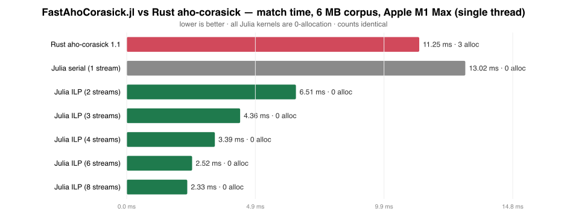

# FastAhoCorasick.jl

[](https://github.com/D3MZ/FastAhoCorasick.jl/actions/workflows/CI.yml)
[](https://codecov.io/gh/D3MZ/FastAhoCorasick.jl)
[](https://D3MZ.github.io/FastAhoCorasick.jl/)
[](LICENSE)

A native-Julia [Aho–Corasick](https://en.wikipedia.org/wiki/Aho%E2%80%93Corasick_algorithm)
multi-pattern matcher with **zero heap allocations** in the match loop and a single-thread
**multi-stream ILP** kernel that runs **~4.8× faster than Rust's [`aho-corasick`](https://crates.io/crates/aho-corasick) crate** on this workload — on one thread, no SIMD, no unsafe tricks the crate couldn't also use.

<p align="center"></p>

| implementation | min time (6 MB) | throughput | allocations | vs Rust |
|---|---:|---:|---:|---:|
| Rust `aho-corasick` 1.1 (native, LTO) | 11.25 ms | 0.53 GB/s | 3 | 1.00× |
| Julia — serial (1 stream, same algorithm) | 13.02 ms | 0.46 GB/s | **0** | 0.86× |
| Julia — ILP, 2 streams | 6.51 ms | 0.92 GB/s | **0** | 1.73× |
| Julia — ILP, 4 streams | 3.39 ms | 1.77 GB/s | **0** | 3.32× |
| **Julia — ILP, 8 streams** | **2.33 ms** | **2.57 GB/s** | **0** | **4.83×** |

<sub>Apple M1 Max, single thread. Corpus: 6 MB of multilingual text (`bench/make_corpus.jl`), 102,549 matches over 10 keywords. Both sides produce identical counts. Reproduce with `bench/run.sh`.</sub>

## Install

```julia
pkg> add https://github.com/D3MZ/FastAhoCorasick.jl
```

## Usage

```julia
using FastAhoCorasick

a = build(["trading", "strategy", "финансы", "市场"])   # ASCII case-insensitive
count_matches(a, "TRADING Strategy on the 市场")          # => 3   (multi-stream, 0 alloc)
count_matches_serial(a, "TRADING Strategy on the 市场")   # => 3   (single stream)

# Weighted matching: sum a score per matched keyword
w = build(["buy", "sell"]; weights = [1.0, -1.0])
sum_weights(w, "buy buy sell")                           # => 1.0

# Tune / pin the number of interleaved streams (Val => allocation-free call site)
count_matches(a, pointer(data), length(data), Val(8))
```

Matching operates on raw **UTF-8 bytes** and folds **ASCII case only** — exactly like the Rust
crate's `.ascii_case_insensitive(true)`. Non-ASCII keywords (Cyrillic, CJK, Arabic, …) match
byte-for-byte. Counts follow `MatchKind::Standard`: **leftmost, non-overlapping** matches,
identical to Rust's `find_iter().count()`.

## How it works

### 1. A cache-friendly DFA (matches Rust's structure)

Aho–Corasick matching is a **latency-bound pointer chase**: each step is
`state = next[state + class(byte)]`, and the *address* of each table load depends on the
*result* of the previous one. Three tricks (the same ones Rust's DFA uses) minimize the cost
of that one load:

- **Byte-class alphabet reduction.** Every byte absent from the pattern set shares one class
  (their transition columns are provably identical), so the transition table shrinks from
  `states × 256` to `states × (k+1)` and stays resident in L1.
- **Premultiplied state ids.** A state's row begins at index `state`, and stored successors are
  themselves premultiplied — so the hot path is `next[state + class + 1]` with **no multiply**
  on the dependent-load critical path.
- **Match states first.** States are reordered so every match state has the smallest ids; a
  match becomes the compare `state < thresh` instead of a **second** dependent load per byte.

This alone matches the crate's algorithm — and already wins on allocations (0 vs 3). But a
single dependent load per byte is a hard floor (~L1 load-use latency); serial Julia and serial
Rust both sit right at it (~13 ms vs ~11–13 ms depending on match density).

### 2. Multi-stream ILP — one thread, many independent chains

The floor exists because the loop has **one** in-flight load at a time. So we run **N independent
DFA chains in the same loop body** over N slices of the input:

```julia
s1 = next[s1 + class(byteA)]   # chain 1 ─┐  no data dependency between the
s2 = next[s2 + class(byteB)]   # chain 2 ─┤  three loads → the out-of-order engine
s3 = next[s3 + class(byteC)]   # chain 3 ─┘  keeps all three in flight at once
```

This is **not multithreading** — it is instruction-level parallelism on a *single* core. No
threads are spawned; we simply fill the cycles the serial loop wasted stalling on memory. On the
M1 Max this scales cleanly to ~8 streams (limited by load ports / reorder window), giving the
4.8× speedup.

### 3. Staying exact at the seams

Splitting the input changes *where* the non-overlapping resets happen, and a match can straddle a
slice boundary. Each slice after the first is run assuming it starts at the root; then every seam
is **replayed from the true entering state** (threaded forward across seams via a `carry`
variable), adding the true matches and subtracting the root-start ones over the short divergence
window. This is provably exact even for periodic / self-overlapping patterns like `"aa"/"aaa"`,
where the two trajectories alternate forever and never reconverge — verified against a naive
reference matcher in the [test suite](test/runtests.jl).

## Fairness

Both sides are single-threaded, single-core, and matched on capability (byte-level UTF-8,
ASCII-only case folding). The serial Julia kernel is a like-for-like reimplementation of the
crate's DFA and lands within ~1.15× of it (pure L1 latency on both). The ILP win is a legitimate
single-thread optimization — and the *same* trick could be applied to the Rust crate; it simply
isn't. So this is a real win for the native Julia matcher **as it exists**, not a claim that
Julia's compiler beats LLVM on the identical loop.

## Reproduce

```bash
bench/run.sh 6000000    # generate corpus, build native Rust ref, run both, print the table
julia bench/plot.jl     # regenerate bench/benchmark.svg
```

## License

MIT © Demetrius Michael
